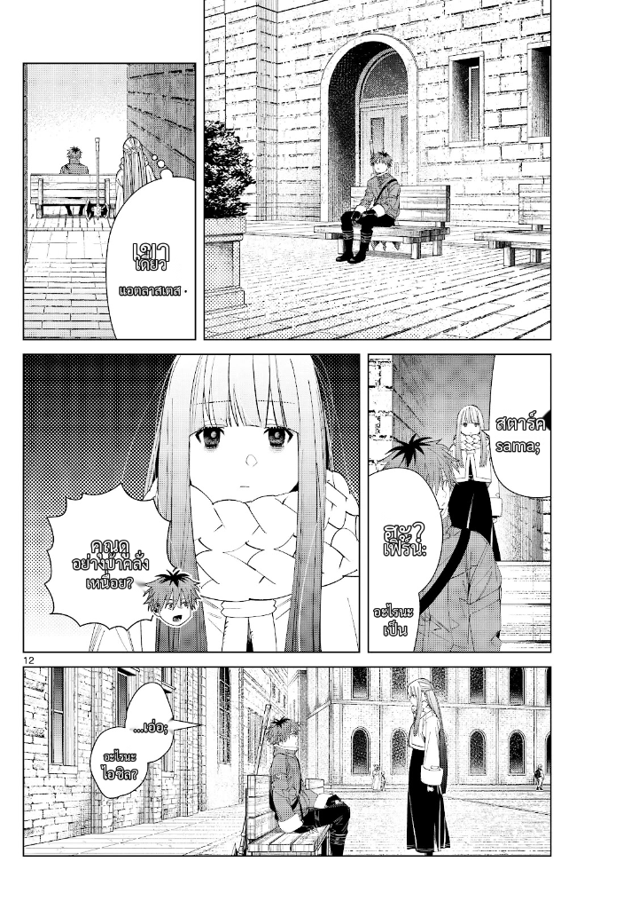

# 🎌 Local Manga Translator

แปลมังงะอัตโนมัติด้วย AI - รองรับทั้ง **รูปภาพ** และ **PDF** | EN/JA → TH

## ✨ Features

- 📖 **PDF Support** - แปลทั้งไฟล์ PDF พร้อม progress bar
- 🎯 **Manga-OCR** - อ่านข้อความญี่ปุ่นในมังงะได้แม่นยำ
- 🌐 **Offline** - ทำงาน local ไม่ต้องพึ่ง API
- ⚡ **GPU Acceleration** - CUDA (Windows) / MPS (Mac)

## ผลลัพธ์

| Before | After |
|:------:|:-----:|
|  |  |

## 🚀 Installation

### Windows

ดับเบิ้ลคลิก `install.bat` แล้วเลือก:
- กด **1** = CPU
- กด **2** = GPU (NVIDIA)

### Mac

```bash
chmod +x install.sh
./install.sh
```
เลือก:
- กด **1** = CPU (Intel Mac)
- กด **2** = MPS (Apple Silicon M1/M2/M3)

### Manual

```bash
# CPU
python3 -m pip install -r requirements.txt

# GPU (NVIDIA - Windows/Linux)
python3 -m pip install -r requirements.txt
python3 -m pip uninstall torch torchvision -y
python3 -m pip install torch torchvision --index-url https://download.pytorch.org/whl/cu128
```

## ▶️ Run

```bash
python -m uvicorn app.main:app --reload --port 8000
```

เปิด http://localhost:8000

## 💾 Requirements

| Platform | Mode | RAM | GPU Memory | Speed |
|----------|------|-----|------------|-------|
| Windows | CPU | ~13GB | - | 🐢 |
| Windows | CUDA | ~4GB | ~8GB VRAM | ⚡ |
| Mac Intel | CPU | ~13GB | - | 🐢 |
| Mac M1/M2/M3 | MPS | ~8GB | Unified | ⚡ |

---

Made with ❤️ for manga lovers
